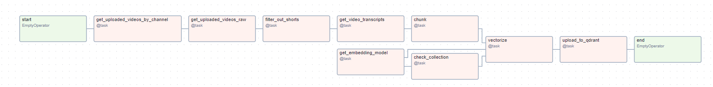

# MorePlatesMoreDates Retrieval Augmented Generation
A RAG Application that allows users to chat with the More Plate More Dates YouTube Channel

## Features:
- An Airflow DAG orchestrated on a [insert Cloud here] VM
  - Coterie of DAG functions including the use of HuggingFace Transformers
  - Data extracted from the YouTube API, then the YouTube Transcripts API/library
- Qdrant cluster operated on it's free tier

### Dag:

<!-- use $ pip install grpcio-tools==1.60.0 grpcio==1.60.0 to resolve dependency errors -->
<!-- ; platform_system=="Windows" on pywin line -->
Git branching practice [link](https://learngitbranching.js.org/?locale=en_US)